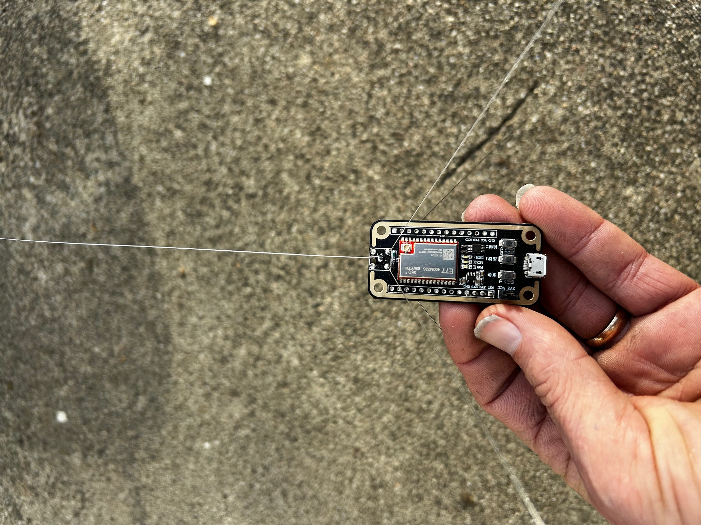
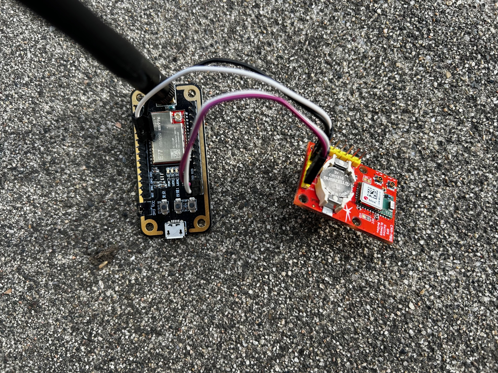
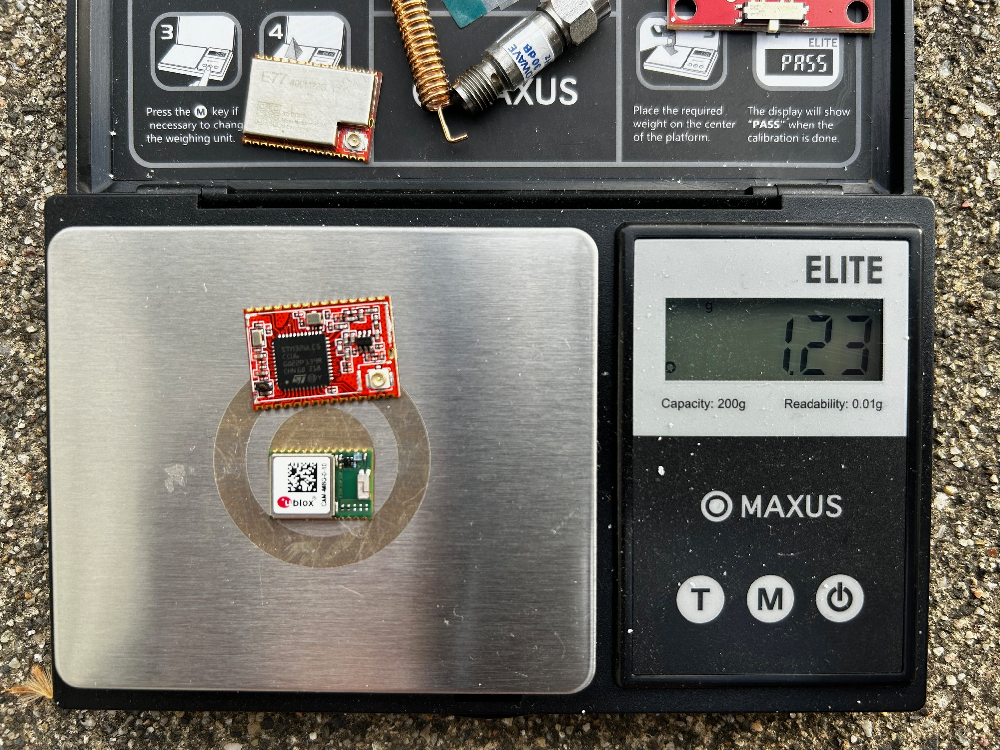

# Pico Lora APRS

This firmware uses LightTracker 1.1 433MHz open source code from https://github.com/lightaprs/LightTracker-1.1-433 and ports it for use on a Ebyte E77 mcu - lora 433 mhz module. The development board can be purchased for about $10 from China. 

It is able to report location, altitude, temperature and pressure to the internet via LoRa APRS gateways or direct to another LoRa radio module with a solar panel/super capacitors or just 3xAAA batteries.
Because it is open source you can add your own custom sensors via I2C pins.

**Important :** This may require an amateur radio license to operate if 433 MHz is not ISM band in your country. So check regulations before using it.

## Basic Features

- **Software** : Open Source
- **Weight** : 6.5 grams without E77 dev board with antenna and no gps (with pins and sma connector manually removed)
- **Weight** : 1.3 grams with only the gps module and the E77 module
- **Dimensions** : x mm x x mm
- **IDE** : Platformio
- **Platform** : STM32 Cortex-M4 with a SX1262 built in to the chip
- **CPU** : STM32WLE5CCU6
- **Flash** : 256 kB
- **Ram** : 64 kB
- **Operating Frequency** : 48 Mhz but could be reduced for more energy savings
- **Operating Voltage** : 3.3 Volt
- **Input Voltage** : 
- **Sensor** : HP303B (pressure and temperature) sensor not on board, but can be added
- **Power Consumption** : TBD
- **LoRa STM32 dev board** : [EBYTE E77 dev board](https://www.cdebyte.com/products/E77-400MBL-01) (SX1262)
- **LoRa Radio Module** : [EBYTE E77 module](https://www.cdebyte.com/products/E77-400M22S) (SX1262)
- **LoRa Operating Frequency** : 410~510MHz (configurable by code)
- **LoRa Max Power** : 22dBm (configurable by code)
- **LoRa Power Consumption (TX)** : ~110 mA (22dBm)
- **GPS** : Ublox CAM-M8Q (GPS-GLONASS) or MAX-M8Q
- **Extended Pins** : many

